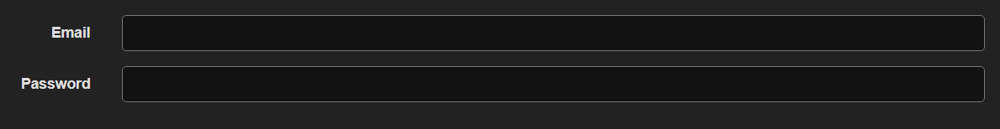

# internship

## Run

```
python manage.py makemigrations
python manage.py migrate
python manage.py createsuperuser
```

then add your user

### Run tests

```
python manage.py test accounts/
```

### Django models

* Custom user model - Account model:
  * email
  * first_name
  * last_name
  * is_active
  * is_staff
* IP address model
  * ip_address
  * account - Foreign Key to Account model in order to save IP instances as related
  * verified

### API Endpoints

API is browsable and supports HTML forms, default content-type is application/json

#### Company

> GET, POST companies/

* Get provides a list of companies and can only be accessed by the super admin user
* Post creates a company and only a super admin can use post also


or

{
    "name": "",
    "admin": null,
    "active_until": null
}

* Default value for active until is 3 months and it doesn't have to be provided in post request

> GET, PUT companies/<name>/

* Detail view for companies uses company name as a parameter in URL
* Put request deactivates the company


or

{
    "id": "df3e4bca-b344-4d5a-9d2a-7b7909513218",
    "name": "new",
    "admin": "2ae99046-60c0-4354-abac-2f5e45438e19",
    "active_until": "2023-03-15T14:25:01.878948Z",
    "is_active": true,
    "accounts": []
}

#### Invites

> GET, POST, HEAD, OPTIONS invites/


or

```
{
    "email": "",
    "invited_by": null,
    "accepted": false
}
```

* Invites can only be created by company admin user.
* Creating an invite generates an email which is sent automatically with registration link

#### Register a user account

> POST auth/register/<uidb64>/<token>


or

```
{
    "username": "",
    "email": "",
    "password1": "",
    "password2": "",
    "first_name": "",
    "last_name": ""
}
```

* Registration automatically saves and verifies user's IP address
* In order to register correctly user has to verify the email address with confirmation email which is sent via console.backend
* When email is verified the user is redirected to login URL
* Registration only works with invite which generates the correct register link which is then sent in email
* View checks arguments from the URL to see if the right user is trying to register and decodes token and uid parameters from the URL
* Register view automatically sets the invite as accepted when the user visits the link

#### Login user

Login is done with email address

> POST auth/login/



or

```
{
    "email": "",
    "password": ""
}
```

* If user tries to login from different IP it is needed to verify that IP address via email
* Response is plain JSON that IP is verified

#### Password Reset

> POST auth/password/reset/


or

```
{
    "email": ""
}
```

* Returns a success or fail message and sends an email with password reset link

> POST auth/password/reset/confirm/


or

```
{
    "new_password1": "",
    "new_password2": "",
    "uid": "",
    "token": ""
}
```

* View that is generated with email confirmation, should be handled from front end as it needs a token and UID passed from user instance

#### User Endpoint

> GET auth/ user/

* User needs to be logged in to access this endpoint. Only username and personal info is editable.
* Accepts PUT and PATCH requests
