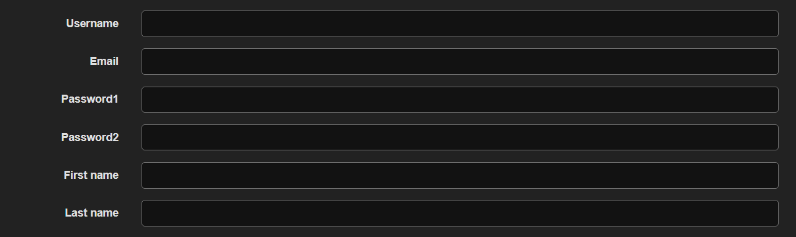

# internship

## Run

```
python manage.py makemigrations
python manage.py migrate
python manage.py createsuperuser
```

then add your user

### Run tests

```
python manage.py test accounts/
```

### Django models

* Custom user model - Account model:
  * email
  * username
  * first_name
  * last_name
  * is_active
  * is_staff
* IP address model
  * ip_address
  * account - Foreign Key to Account model in order to save IP instances as related
  * verified

### API Endpoints

API is browsable and supports HTML forms, default content-type is application/json

#### Register a user account

> POST auth/registration/




or

```
{
    "username": "",
    "email": "",
    "password1": "",
    "password2": "",
    "first_name": "",
    "last_name": ""
}
```

* Registration automatically saves and verifies user's IP address
* In order to register fully user has to verify the email address with confirmation email which is sent via console.backend
* When email is verified the user is redirected to login URL

#### Login user

Login is done with email address

> POST auth/login/


or

```
{
    "email": "",
    "password": ""
}
```

* If user tries to login from different IP it is needed to verify that IP address via email
* Response is plain JSON that IP is verified

#### Password Reset

> POST auth/password/reset/


or

```
{
    "email": ""
}
```

* Returns a success or fail message and sends an email with password reset link

> POST auth/password/reset/confirm/


or

```
{
    "new_password1": "",
    "new_password2": "",
    "uid": "",
    "token": ""
}
```

* View that is generated with email confirmation, should be handled from front end as it needs a token and UID passed from user instance

#### User Endpoint

> GET auth/ user/

* User needs to be logged in to access this endpoint. Only username and personal info is editable.
* Accepts PUT and PATCH requests
